# libdft64 Design Document

## 1. Overview

**libdft64** is a dynamic data flow tracking (DFT) framework built on Intel Pin for x86-64 architectures. It provides byte-level taint tracking capabilities through dynamic binary instrumentation (DBI), enabling security analysis, vulnerability detection, and program behavior monitoring without requiring source code or recompilation.

### 1.1 Key Features
- **Intel Pin 3.x Integration**: Leverages Intel's DBI framework for runtime instrumentation
- **64-bit Support**: Full support for x86-64 architecture with GPRs and SIMD registers
- **BDD-Based Tagging**: Uses Binary Decision Diagram (BDD) data structures for efficient tag management
- **Byte-Level Granularity**: Tracks taint at byte-level precision
- **Extensible API**: Provides hooks for custom taint sources and sinks
- **Multi-threaded Support**: Per-thread virtual CPU (VCPU) contexts

### 1.2 Limitations
- **Byte-level only**: Does not support bit-level tracking
- **Explicit flows only**: Ignores implicit information flows
- **No EFLAGS tracking**: Does not track taint through status flags
- **Incomplete ISA coverage**: Supports basic instructions but not all x86-64 instructions

---

## 2. High-Level Architecture

The system follows a layered architecture:

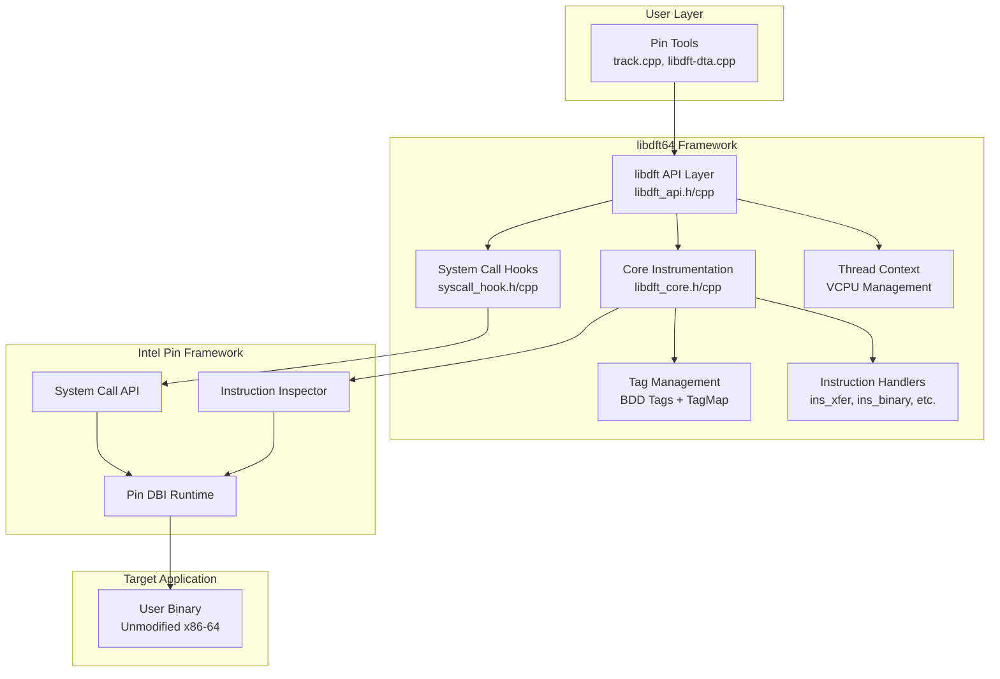

**Data Flow**:
1. Pin instruments the target binary at runtime
2. libdft64 registers callbacks for instruction and syscall events
3. Each instruction is analyzed and taint propagation logic is inserted
4. Tags are stored in shadow memory (TagMap) and virtual registers (VCPU)
5. User tools define taint sources (e.g., file reads) and sinks (e.g., indirect jumps)

---

## 3. Core Components

### 3.1 Component Diagram

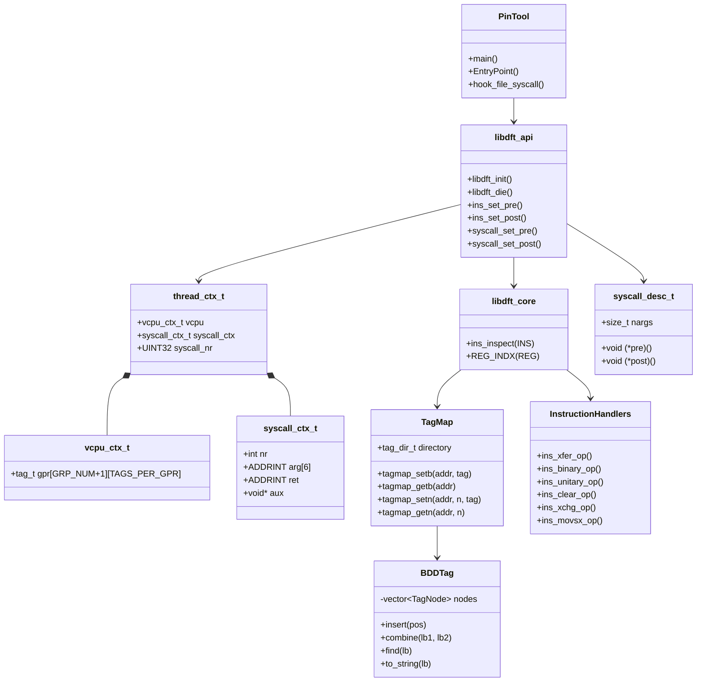

---

## 4. Detailed Design

### 4.1 Tag Management System

The tag management system is the core of the taint tracking mechanism.

#### 4.1.1 Tag Representation

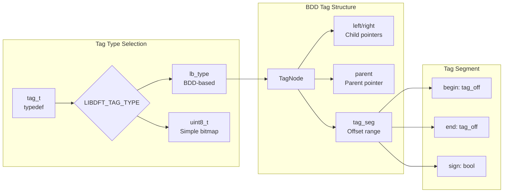

**Key Characteristics**:
- **BDD Structure**: Uses a tree structure to represent sets of tainted byte offsets
- **Space Efficient**: Shares common subtrees to reduce memory usage
- **lb_type**: 32-bit label type with 24-bit width for BDD nodes
- **Operations**: insert, combine, find, set_sign, set_size

#### 4.1.2 Shadow Memory - TagMap

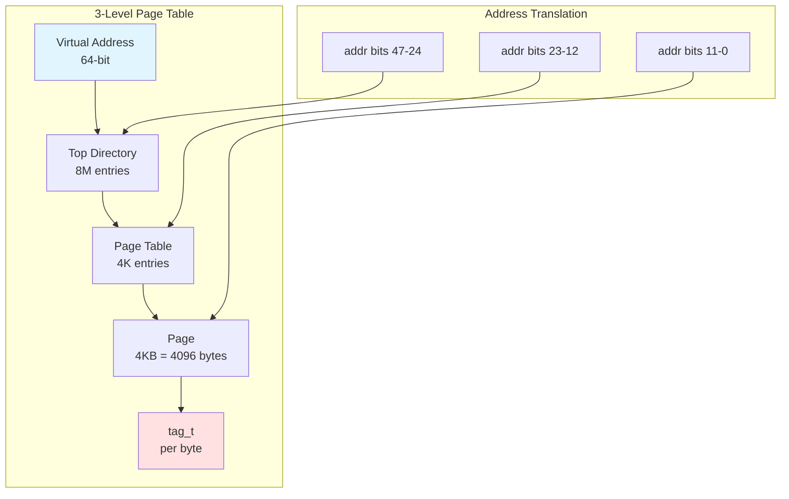

**Memory Layout**:
- **tag_dir_t**: Top-level directory (8M pointers to page tables)
- **tag_table_t**: Page table (4K pointers to pages)
- **tag_page_t**: Actual tag storage (4096 tag_t values)
- **Lazy Allocation**: Pages allocated on-demand to save memory

**API Functions**:
- `tagmap_setb(addr, tag)`: Set tag for 1 byte
- `tagmap_getb(addr)`: Get tag for 1 byte
- `tagmap_setn(addr, n, tag)`: Set tag for n bytes
- `tagmap_getn(addr, n)`: Combine tags for n bytes

#### 4.1.3 Virtual CPU (VCPU) Context

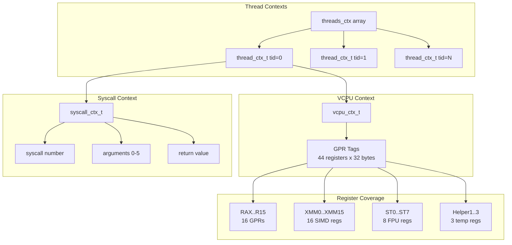

**Storage**:
- Each register has up to 32 tag slots (256 bits = 32 bytes for YMM registers)
- Tag arrays indexed by `DFT_REG_*` constants
- Macros like `RTAG[reg_idx]` provide fast access

---

### 4.2 Instruction Instrumentation Pipeline

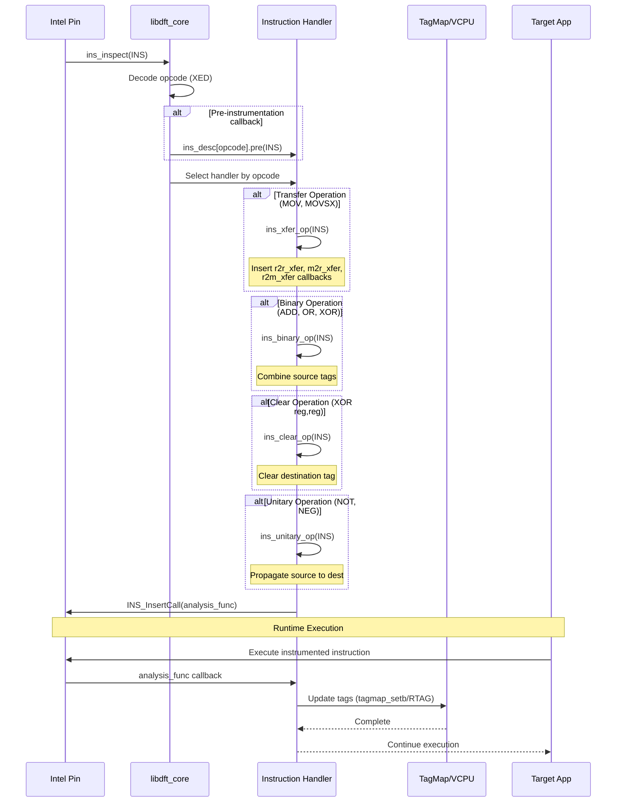

**Instrumentation Flow**:
1. **Decode**: Pin calls `ins_inspect()` for each instruction
2. **Classify**: Extract opcode using XED (X86 Encoder Decoder)
3. **Select Handler**: Dispatch to appropriate handler based on instruction category
4. **Insert Analysis**: Handler inserts runtime callbacks via `INS_InsertCall()`
5. **Execute**: At runtime, callbacks propagate taint according to instruction semantics

---

### 4.3 Instruction Handler Categories

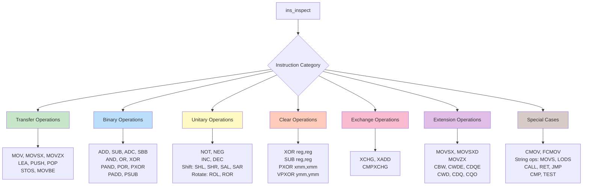

**Handler Responsibilities**:
- **Transfer**: Copy tags from source to destination
- **Binary**: Combine (union) source tags to destination
- **Unitary**: Propagate input tag to output
- **Clear**: Set destination tag to empty
- **Exchange**: Swap tags between operands
- **Extension**: Sign/zero extend with tag propagation

### 4.3.1 Instruction Handler Macros

libdft64 uses a family of macros in `ins_helper.h` to insert Pin analysis calls
with consistent argument layouts. The macros encode three decisions:
1) operand shape (register, memory, or both), 2) predication, and 3) optional
PC logging (the `*_LOG` variants add `IARG_INST_PTR`).

**Core macros**:
- `CALL(fn)`: Insert a simple analysis call with only `IARG_THREAD_ID`.
- `R_CALL(fn, dst)`: Thread id + a single register index (`REG_INDX(dst)`).
- `M_CALL_R(fn)`, `M_CALL_W(fn)`: Memory-only analysis with read/write EA.
- `R2R_CALL(fn, dst, src)`: Thread id + destination register index + source register index.
- `M2R_CALL(fn, dst)`: Thread id + destination register index + memory read EA.
- `R2M_CALL(fn, src)`: Thread id + memory write EA + source register index.
- `M2M_CALL(fn)`: Predicated call with memory write EA + memory read EA.
- `RR2R_CALL(fn, dst, src1, src2)`: Ternary register ops with three register indices.
- `M_CLEAR_N(n)`: Clear `n` bytes at memory write EA.

**Predicated macros**:
- `R2R_CALL_P`, `M2R_CALL_P` use `INS_InsertPredicatedCall` to run only when
    the instruction actually executes (e.g., conditional moves or string ops).

**Logging macros**:
- `*_LOG` variants mirror the core macros but also pass `IARG_INST_PTR` so the
    analysis can log the instruction PC before taint propagation.

### 4.3.2 Instruction Dispatch in `ins_inspect`

`libdft_core.cpp::ins_inspect` is the central routing table that maps XED
opcodes to handler families. The dispatch is grouped by instruction semantics:

- **Binary ops**: `ADD`, `ADC`, `AND`, `OR`, `XOR`, `SUB`, `SBB`, SIMD variants
    like `ADDPD`, `XORPS`, `PXOR` use `ins_binary_op`.
    - Special case: `XOR reg, reg` (same register) is treated as a clear op.
- **Unitary/mul/div**: `DIV`, `IDIV`, `MUL` use `ins_unitary_op`.
    - `IMUL` uses unitary or binary depending on operand form.
- **Transfer ops**: `MOV` and SIMD move/cvt forms (`MOVD`, `MOVAPS`, `CVT*`) use
    `ins_xfer_op`, except immediate/segment moves which are treated as clear.
- **Extension ops**: `MOVSX`, `MOVZX`, `MOVSXD`, `CBW`, `CWDE`, `CDQE`, `CWD`,
    `CDQ`, `CQO` use `ins_movsx_op`, `ins_movsxd_op`, or small helper callbacks.
- **Predicated transfer**: `CMOV*` uses `ins_xfer_op_predicated`.
- **Clear ops**: `SETcc`, `RDRAND`, `RDPID`, `RDPMC`, `RDTSC`, `CPUID`, `LAHF`,
    and some flag-producing instructions use `ins_clear_op` variants.
- **Exchange/atomic**: `XCHG`, `XADD`, `CMPXCHG` use dedicated handlers.
- **String ops**: `LODS*`, `MOVS*`, `STOS*` use memory-to-register or memory-to-
    memory helpers and may be predicated.
- **Ignored/TODO**: Many control-flow, flag-only, and advanced SIMD ops are
    currently ignored or logged as uninstrumented for later expansion.

---

### 4.4 System Call Hooking

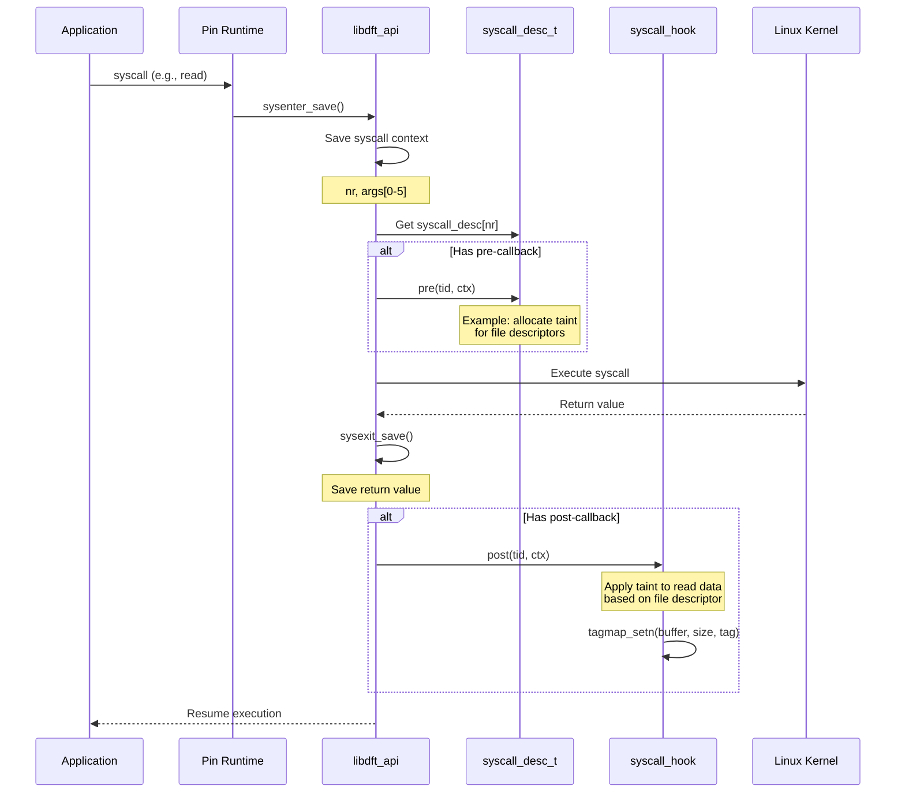

**Syscall Descriptor Structure**:
- **nargs**: Number of arguments to save
- **save_args**: Flag to save argument values
- **retval_args**: Flag if syscall modifies arguments
- **map_args[]**: Mapping of argument positions
- **pre/post callbacks**: User-defined hooks

**Common Hooks**:
- **read/pread**: Taint input data from file descriptors
- **write/pwrite**: Check taint on output data
- **open/openat**: Track file descriptor mappings
- **mmap**: Handle memory-mapped file tainting

---

### 4.5 Taint Propagation Rules

#### 4.5.1 Transfer Instructions

```
MOV dst, src
  tag[dst] ← tag[src]

MOVSX dst, src (sign extend)
  For each byte i in dst:
    if i < size(src): tag[dst[i]] ← tag[src[i]]
    else: tag[dst[i]] ← tag[src[size(src)-1]]
```

#### 4.5.2 Binary Operations

```
ADD/OR/XOR dst, src
  tag[dst] ← tag[dst] ∪ tag[src]

PAND/POR/PXOR dst, src (SIMD)
  For each byte i:
    tag[dst[i]] ← tag[dst[i]] ∪ tag[src[i]]
```

#### 4.5.3 Clear Operations

```
XOR reg, reg
SUB reg, reg
  tag[reg] ← ∅  (empty set)
```

#### 4.5.4 Conditional Moves

```
CMOV dst, src
  If condition true:
    tag[dst] ← tag[src]
  Else:
    tag[dst] ← tag[dst]  (unchanged)
```

**Note**: These are simplified rules. The actual implementation handles operand sizes (byte/word/dword/qword), register aliasing, and memory vs. register operands.

---

### 4.6 Pin Tool Integration

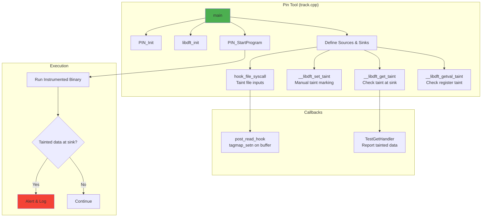

**Tool Development Steps**:
1. **Initialize**: Call `PIN_Init()` and `libdft_init()`
2. **Define Sources**: Register syscall hooks or use `__libdft_set_taint()`
3. **Define Sinks**: Use RTN hooks or `__libdft_get_taint()` checks
4. **Start Execution**: Call `PIN_StartProgram()`
5. **Handle Alerts**: Implement callbacks for tainted sinks

**Example Tools**:
- **nullpin**: Baseline Pin overhead measurement (no instrumentation)
- **libdft**: Full DFT without custom sources/sinks (overhead measurement)
- **track**: DTA tool with file input as source, indirect jumps as sinks
- **libdft-dta**: Dynamic taint analysis for exploit detection

---

## 5. Data Structures

### 5.1 Key Type Definitions

```c
// Tag type (default: BDD-based)
typedef uint32_t lb_type;
typedef LIBDFT_TAG_TYPE tag_t;  // lb_type or uint8_t

// Tag segment (offset range)
struct tag_seg {
    bool sign;
    tag_off begin;
    tag_off end;
};

// BDD node
class TagNode {
    lb_type left, right, parent;
    tag_seg seg;
};

// Thread context
typedef struct {
    vcpu_ctx_t vcpu;           // Register tags
    syscall_ctx_t syscall_ctx; // Syscall state
    UINT32 syscall_nr;
} thread_ctx_t;

// VCPU register tags
typedef struct {
    tag_t gpr[44][32];  // 44 regs x 32 bytes each
} vcpu_ctx_t;

// System call context
typedef struct {
    int nr;                 // Syscall number
    ADDRINT arg[6];         // Arguments
    ADDRINT ret;            // Return value
    void *aux;              // Auxiliary data
} syscall_ctx_t;
```

### 5.2 Memory Footprint

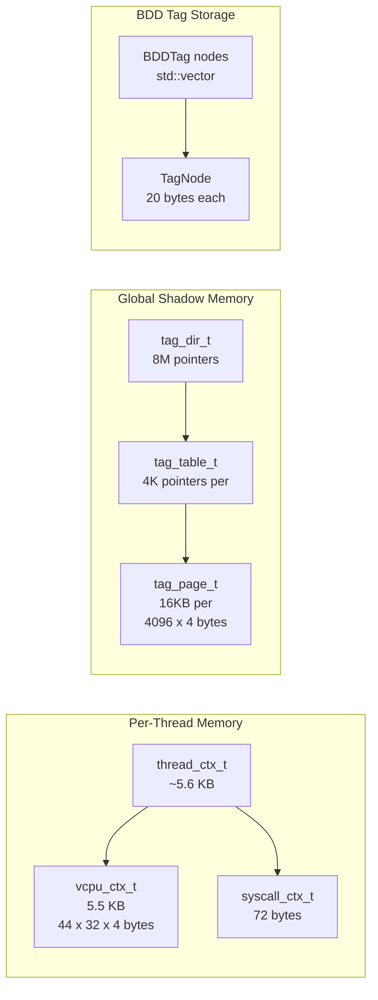

**Memory Considerations**:
- **VCPU**: ~5.5KB per thread (44 registers × 32 bytes × 4 bytes/tag)
- **Shadow Memory**: Sparse allocation, typically 10-50% of application memory
- **BDD Nodes**: Shared structure reduces duplication, scales with taint complexity

---

## 6. Execution Flow

### 6.1 Initialization Sequence

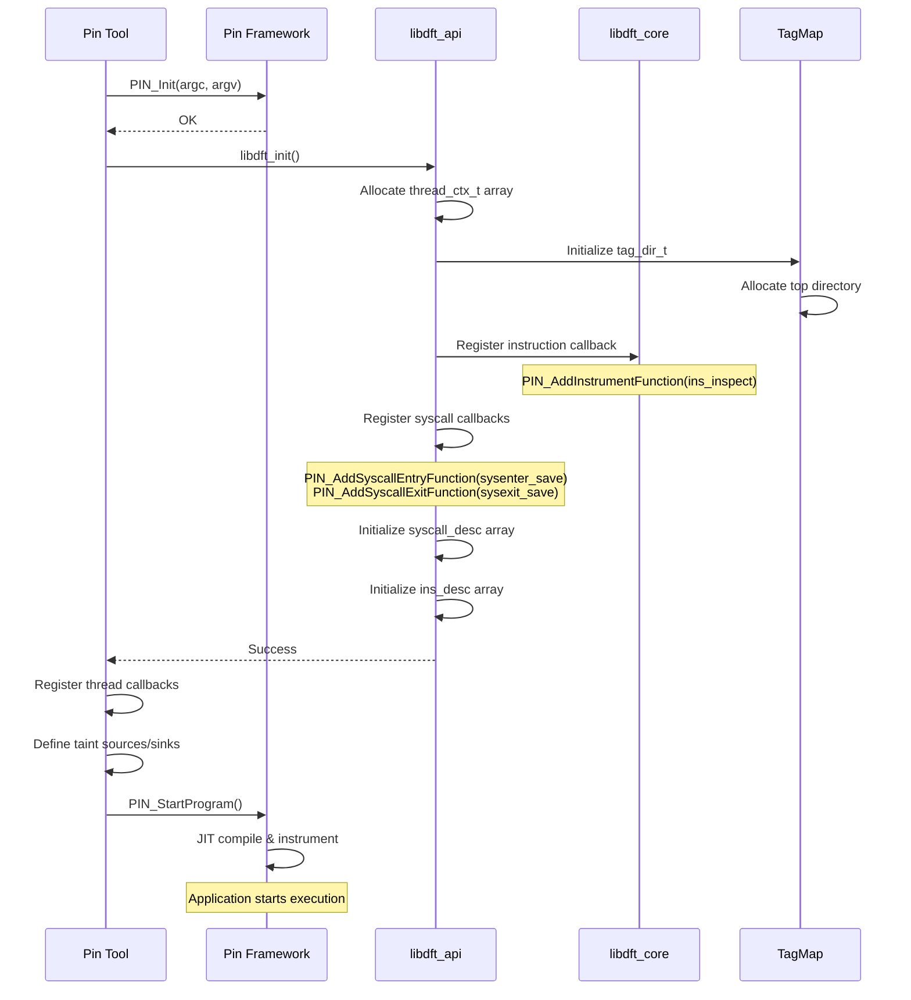

### 6.2 Runtime Taint Propagation

```mermaid
graph TB
    subgraph "1. Taint Source"
        A[syscall: read fd=3<br/>buffer=0x7fff1000<br/>count=256]
        A --> B{FD tracked?}
        B -->|Yes| C[post_read_hook]
        C --> D[tagmap_setn<br/>0x7fff1000, 256, tag=3]
    end

    subgraph "2. Instruction Execution"
        E[MOV rax, [0x7fff1000]]
        E --> F[m2r_xfer_opq callback]
        F --> G[tag = tagmap_getn<br/>0x7fff1000, 8]
        G --> H[RTAG[RAX] = tag]
    end

    subgraph "3. Taint Propagation"
        I[ADD rbx, rax]
        I --> J[r2r_binary_opq]
        J --> K[tag = RTAG[RBX] ∪ RTAG[RAX]]
        K --> L[RTAG[RBX] = tag]
    end

    subgraph "4. Taint Sink"
        M[JMP rbx]
        M --> N{tag_is_empty<br/>RTAG[RBX]?}
        N -->|No| O[ALERT: Tainted control flow!]
        N -->|Yes| P[Continue]
    end

    D --> E
    H --> I
    L --> M

    style A fill:#e3f2fd
    style D fill:#c8e6c9
    style H fill:#fff9c4
    style L fill:#ffe0b2
    style O fill:#ffcdd2
```

---

## 7. API Reference

### 7.1 Core API

```c
// Initialization
int libdft_init(void);          // Initialize libdft framework
void libdft_die(void);          // Cleanup and exit

// Instruction hooks
int ins_set_pre(ins_desc_t*, void(*)(INS));   // Set pre-ins callback
int ins_clr_pre(ins_desc_t*);                 // Clear pre-ins callback
int ins_set_post(ins_desc_t*, void(*)(INS));  // Set post-ins callback
int ins_clr_post(ins_desc_t*);                // Clear post-ins callback

// System call hooks
int syscall_set_pre(syscall_desc_t*, void(*)(THREADID, syscall_ctx_t*));
int syscall_set_post(syscall_desc_t*, void(*)(THREADID, syscall_ctx_t*));
```

### 7.2 TagMap API

```c
// Memory tag operations
void tagmap_setb(ADDRINT addr, tag_t const& tag);  // Set 1 byte
tag_t tagmap_getb(ADDRINT addr);                    // Get 1 byte
void tagmap_setn(ADDRINT addr, UINT32 n, tag_t const& tag);  // Set n bytes
tag_t tagmap_getn(ADDRINT addr, UINT32 n);          // Get n bytes (union)

// Register tag operations
void tagmap_setb_reg(THREADID tid, unsigned int reg_idx,
                     unsigned int off, tag_t const& tag);
tag_t tagmap_getb_reg(THREADID tid, unsigned int reg_idx, unsigned int off);
tag_t tagmap_getn_reg(THREADID tid, unsigned int reg_idx, unsigned int n);

// Clear operations
void tagmap_clrb(ADDRINT addr);            // Clear 1 byte
void tagmap_clrn(ADDRINT addr, UINT32 n);  // Clear n bytes
```

### 7.3 BDD Tag API

```c++
class BDDTag {
public:
    lb_type insert(tag_off pos);              // Insert offset into set
    lb_type combine(lb_type lb1, lb_type lb2); // Union of two tags
    const std::vector<tag_seg> find(lb_type lb); // Get all segments
    std::string to_string(lb_type lb);         // Debug representation
    void set_sign(lb_type lb);                 // Mark tag
    bool get_sign(lb_type lb);                 // Check mark
    void set_size(lb_type lb, size_t size);    // Set length metadata
};

// Global operations (tag_traits.h)
template<typename T> T tag_combine(T const& lhs, T const& rhs);
template<typename T> std::string tag_sprint(T const& tag);
template<typename T> T tag_alloc(unsigned int offset);
bool tag_is_empty(tag_t const& tag);
```

---

## 8. Usage Examples

### 8.1 Simple Taint Tracking Tool

```cpp
#include "libdft_api.h"
#include "syscall_hook.h"

VOID TestGetHandler(void *p) {
    tag_t t = tagmap_getn((ADDRINT)p, 8);
    if (!tag_is_empty(t)) {
        printf("Tainted data at %p: %s\n", p, tag_sprint(t).c_str());
    }
}

VOID EntryPoint(VOID *v) {
    // Hook user function to check taint
    for (IMG img = APP_ImgHead(); IMG_Valid(img); img = IMG_Next(img)) {
        RTN rtn = RTN_FindByName(img, "__libdft_get_taint");
        if (RTN_Valid(rtn)) {
            RTN_Open(rtn);
            RTN_InsertCall(rtn, IPOINT_BEFORE, (AFUNPTR)TestGetHandler,
                          IARG_FUNCARG_ENTRYPOINT_VALUE, 0, IARG_END);
            RTN_Close(rtn);
        }
    }
}

int main(int argc, char *argv[]) {
    PIN_InitSymbols();
    PIN_Init(argc, argv);
    libdft_init();

    PIN_AddApplicationStartFunction(EntryPoint, 0);
    hook_file_syscall();  // Taint file inputs

    PIN_StartProgram();
    return 0;
}
```

### 8.2 Application Code with Taint Markers

```c
// Application code (to be instrumented)
#include <stdio.h>

void __libdft_set_taint(void *addr, unsigned int label);
void __libdft_get_taint(void *addr);

int main() {
    int x = 42;

    // Mark x as tainted with label 1
    __libdft_set_taint(&x, 1);

    int y = x + 10;  // Taint propagates to y

    // Check taint on y
    __libdft_get_taint(&y);  // Tool will log: "Tainted data at &y: 1"

    return 0;
}
```

---

## 9. Design Patterns & Principles

### 9.1 Architectural Patterns

1. **Layered Architecture**: Clear separation between Pin interface, libdft core, and user tools
2. **Strategy Pattern**: Pluggable instruction handlers via `ins_desc` array
3. **Observer Pattern**: Callbacks for syscall and instruction events
4. **Lazy Initialization**: Shadow memory pages allocated on-demand
5. **Visitor Pattern**: `ins_inspect()` dispatches to specialized handlers

### 9.2 Performance Optimizations

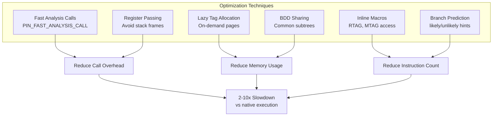

### 9.3 Extensibility Points

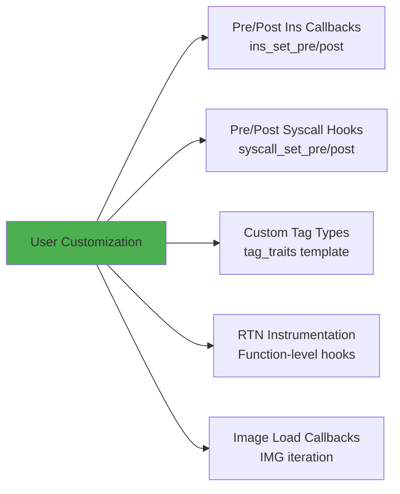

---

## 10. Performance Characteristics

### 10.1 Overhead Analysis

| Component | Slowdown Factor | Notes |
|-----------|----------------|-------|
| Pin Framework | 1.5-2× | Base DBI overhead |
| libdft Instrumentation | 2-5× | Tag propagation logic |
| BDD Operations | 1.2-1.5× | Tag combine/lookup |
| Shadow Memory | 1.1-1.3× | Cache pressure |
| **Total** | **3-10×** | Workload dependent |

### 10.2 Memory Overhead

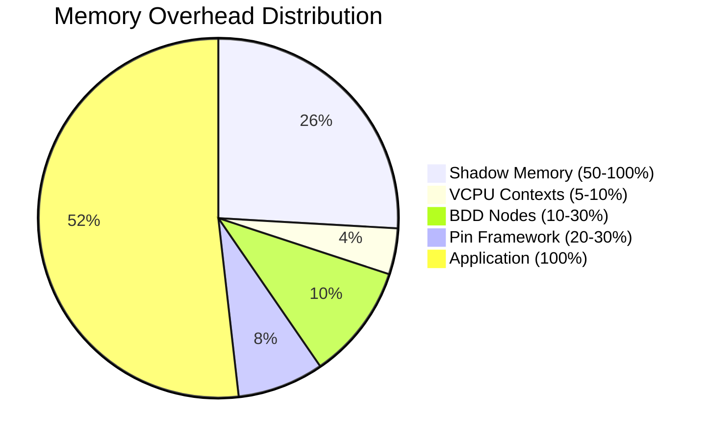

**Typical Overhead**: 1.5-2.5× application memory usage

---

## 11. Limitations & Future Work

### 11.1 Current Limitations

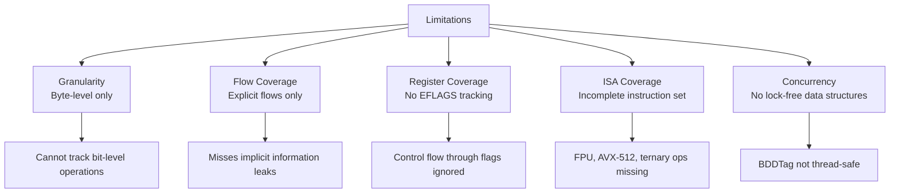

### 11.2 TODO Items

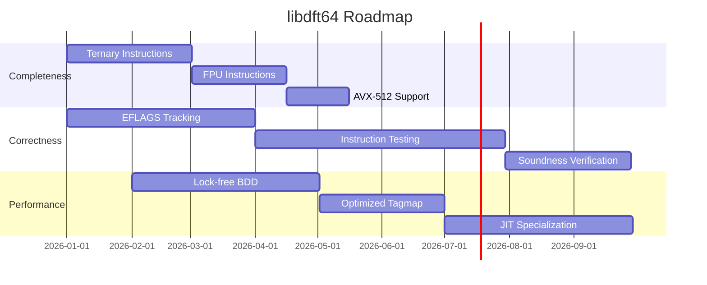

---

## 12. References

### 12.1 Academic Papers

1. **libdft: Practical Dynamic Data Flow Tracking for Commodity Systems**
   Kemerlis et al., VEE 2012
   [PDF](http://nsl.cs.columbia.edu/papers/2012/libdft.vee12.pdf)

2. **A General Approach for Efficiently Accelerating Software-based Dynamic Data Flow Tracking**
   Jee et al., NDSS 2012
   [PDF](http://nsl.cs.columbia.edu/papers/2012/tfa.ndss12.pdf)

3. **Angora: Efficient Fuzzing by Principled Search**
   Chen & Chen, IEEE S&P 2018
   [arXiv](https://arxiv.org/abs/1803.01307)

### 12.2 Related Projects

- **Intel Pin**: [https://www.pintool.org](https://www.pintool.org)
- **libdft (original)**: [Columbia NSL](https://www.cs.columbia.edu/~vpk/research/libdft/)
- **VUzzer64**: [https://github.com/vusec/vuzzer64](https://github.com/vusec/vuzzer64)
- **Angora Fuzzer**: [https://github.com/AngoraFuzzer/Angora](https://github.com/AngoraFuzzer/Angora)

---

## Appendix A: File Structure

```
libdft64/
├── src/                          # Core library
│   ├── libdft_api.{h,cpp}       # Public API
│   ├── libdft_core.{h,cpp}      # Instruction instrumentation
│   ├── bdd_tag.{h,cpp}          # BDD tag implementation
│   ├── tagmap.h                 # Shadow memory interface
│   ├── tag_traits.{h,cpp}       # Tag type traits
│   ├── syscall_desc.{h,cpp}     # Syscall descriptors
│   ├── syscall_hook.{h,cpp}     # Syscall hooks
│   ├── ins_xfer_op.{h,cpp}      # Transfer instructions
│   ├── ins_binary_op.{h,cpp}    # Binary instructions
│   ├── ins_unitary_op.{h,cpp}   # Unitary instructions
│   ├── ins_clear_op.{h,cpp}     # Clear instructions
│   ├── ins_xchg_op.{h,cpp}      # Exchange instructions
│   ├── ins_movsx_op.{h,cpp}     # Extension instructions
│   ├── ins_ternary_op.{h,cpp}   # Ternary instructions (TODO)
│   ├── ins_helper.h             # Helper macros
│   ├── def.h                    # Constants & definitions
│   ├── branch_pred.h            # Branch hints (likely/unlikely)
│   └── debug.h                  # Debug macros
├── tools/                        # Pin tools
│   ├── nullpin.cpp              # Null tool (baseline)
│   ├── libdft.cpp               # Basic DFT tool
│   ├── track.cpp                # DTA tool (file taint)
│   ├── libdft-dta.cpp           # DTA for exploit detection
│   └── mini_test.cpp            # Test harness
├── Makefile                      # Build system
├── README.md                     # User documentation
├── INSTALL.md                    # Installation guide
└── DESIGN.md                     # This document
```

---

## Appendix B: Quick Start

```bash
# 1. Install Intel Pin
PREFIX=/opt/pin ./install_pin.sh

# 2. Build libdft64
export PIN_ROOT=/opt/pin
cd src && make && cd ..

# 3. Build tools
cd tools && make tools && cd ..

# 4. Run example
pin -t tools/obj-intel64/track.so -- /bin/ls

# 5. Test with taint markers
cd tools
make test_mini
pin -t obj-intel64/track.so -- obj-intel64/mini_test.exe test_input
```

---

**Document Version**: 1.0
**Last Updated**: 2026-02-13
**Authors**: Claude (based on libdft64 source code analysis)
